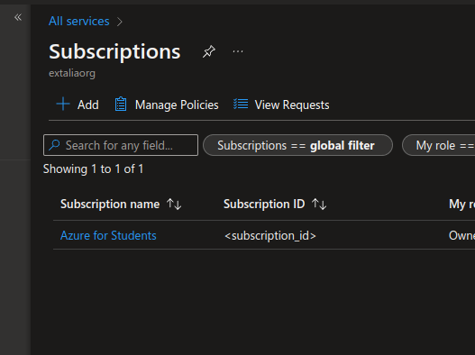
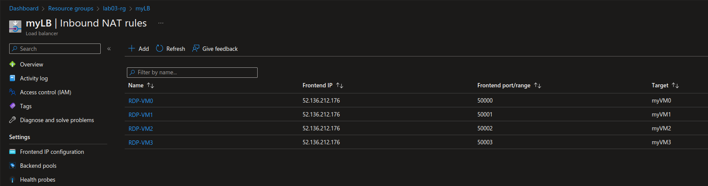

### Lab 2 - Automatyzacja tworzenia zasobów w chmurze za pomocą kodu

#### Zmień identyfikator subskrypcji na swój

Subscription ID:  
Z poziomu portalu `All services -> Subscriptions`  



Z poziomu cli
```
miachal@pc:~$ az account list -o table
Name                CloudName    SubscriptionId                        TenantId                              State    IsDefault
------------------  -----------  ------------------------------------  ------------------------------------  -------  -----------
Azure for Students  AzureCloud   <subscription-id>  <tenant-id>  Enabled  True
```
### __Terraform__ - ćw. 1
Bo terraform ma zbyt dużo literek... `alias tf="terraform"`

#### Uruchom polecenie terraform tak, by utworzyło tylko jeden konkretny zasób z Twojej listy zasobów
https://developer.hashicorp.com/terraform/cli/commands/plan#resource-targeting

```
tf apply -target=azurerm_subnet.vnet-global-azurefirewall-subnet
```

```
Plan: 3 to add, 0 to change, 0 to destroy.
# azurerm_resource_group.global-net-rg will be created
# azurerm_subnet.vnet-global-azurefirewall-subnet will be created
# azurerm_virtual_network.vnet-global will be created
```

Czyli tf jest na tyle sprytny, że mimo targetowania potrafi sobie wyciągnąć niezbędne zależności.

#### Uruchomić polecenie terraform tak, by usunęło tylko jeden konkretny zasób z Twojej listy zasobów

`tf destroy === tf apply -destroy`

```
tf apply -destroy -target=azurerm_resource_group.global-net-rg
```
```
Plan: 0 to add, 0 to change, 3 to destroy.
```

W drugą stronę też potrafi. :)

#### Uruchomić polecenie terraform tak, by pokazana została lista zasobów, które są zapisane w stanie Terraform  

```
miachal@pc:~$ tf state list
azurerm_resource_group.global-net-rg
azurerm_subnet.vnet-global-azurefirewall-subnet
azurerm_virtual_network.vnet-global
```

i wyświetlić informacje o konkretnym zasobie
```
miachal@pc:~$ tf state show azurerm_resource_group.global-net-rg
# azurerm_resource_group.global-net-rg:
resource "azurerm_resource_group" "global-net-rg" {
    id       = "/subscriptions/subscription-id/resourceGroups/global-net-rg"
    location = "westeurope"
    name     = "global-net-rg"
}
```

#### Uruchomić polecenie terraform tak, by dodać do stanu terraform zasób, który jest w chmurze, ale dopiero teraz stworzyłeś dla niego kod w terraform

* Utworzenie RG z CLI
```
miachal@pc:~$ az group create -n lab03-wannabe-imported-rg -l westeurope
{
  "id": "/subscriptions/subscription-id/resourceGroups/lab03-wannabe-imported-rg",
  "location": "westeurope",
  "managedBy": null,
  "name": "lab03-wannabe-imported-rg",
  "properties": {
    "provisioningState": "Succeeded"
  },
  "tags": null,
  "type": "Microsoft.Resources/resourceGroups"
}
```
* Dodanie definicji zasobu w terraformie
```
resource "azurerm_resource_group" "imported" {
  name     = "lab03-wannabe-imported-rg"
  location = var.location
}
```
* Pobranie ID zasobu  
Z portalu: `Resource groups -> grupa -> Properties -> Resource ID`  
Z cli: 
```
miachal@pc:~$ az group show -n lab03-wannabe-imported-rg
{
  "id": "/subscriptions/subscription-id/resourceGroups/lab03-wannabe-imported-rg",
  "location": "westeurope",
  "managedBy": null,
  "name": "lab03-wannabe-imported-rg",
  "properties": {
    "provisioningState": "Succeeded"
  },
  "tags": null,
  "type": "Microsoft.Resources/resourceGroups"
}
```
* Import zasobu
```
miachal@pc:~$ tf import azurerm_resource_group.imported /subscriptions/subscription-id/resourceGroups/lab03-wannabe-imported-rg
azurerm_resource_group.imported: Importing from ID "/subscriptions/subscription-id/resourceGroups/lab03-wannabe-imported-rg"...
azurerm_resource_group.imported: Import prepared!
  Prepared azurerm_resource_group for import
azurerm_resource_group.imported: Refreshing state... [id=/subscriptions/subscription-id/resourceGroups/lab03-wannabe-imported-rg]

Import successful!

The resources that were imported are shown above. These resources are now in
your Terraform state and will henceforth be managed by Terraform.
```
* Sprawdzenie stanu terraforma
```
miachal@pc:~$ tf state list
azurerm_resource_group.global-net-rg
azurerm_resource_group.imported
azurerm_subnet.vnet-global-azurefirewall-subnet
azurerm_virtual_network.vnet-global
```
* Sprawdzenie stanu zaimportowanego zasobu
```
miachal@pc:~$ tf state show azurerm_resource_group.imported
# azurerm_resource_group.imported:
resource "azurerm_resource_group" "imported" {
    id       = "/subscriptions/subscription-id/resourceGroups/lab03-wannabe-imported-rg"
    location = "westeurope"
    name     = "lab03-wannabe-imported-rg"
    tags     = {}

    timeouts {}
}
```

### __ARM (Azure Resource Manager)__ - ćw. 1

group deployment
https://learn.microsoft.com/en-us/cli/azure/deployment/group?view=azure-cli-latest

* Empty template deployment
```json
miachal@pc:~$ az deployment group create -g lab03-rg --template-uri https://raw.githubusercontent.com/mifurm/ARMWorkshop/master/emptytemplate.json
{
  "id": "/subscriptions/subscription-id/resourceGroups/lab03-rg/providers/Microsoft.Resources/deployments/emptytemplate",
  "location": null,
  "name": "emptytemplate",
  "properties": {
    "correlationId": "16316995-8407-43b2-8714-6a6ad6741128",
    "debugSetting": null,
    "dependencies": [],
    "duration": "PT0.704696S",
    "error": null,
    "mode": "Incremental",
    "onErrorDeployment": null,
    "outputResources": [],
    "outputs": {
      "message": {
        "type": "String",
        "value": "ARMWorkshop1.00"
      }
    },
    "parameters": {},
    "parametersLink": null,
    "providers": [],
    "provisioningState": "Succeeded",
    "templateHash": "9465262459192946575",
    "templateLink": {
      "contentVersion": "1.0.0.0",
      "id": null,
      "queryString": null,
      "relativePath": null,
      "uri": "https://raw.githubusercontent.com/mifurm/ARMWorkshop/master/emptytemplate.json"
    },
    "timestamp": "2022-11-02T23:30:41.996905+00:00",
    "validatedResources": null
  },
  "resourceGroup": "lab03-rg",
  "tags": null,
  "type": "Microsoft.Resources/deployments"
}
```

* Sprawdź w historii deploymentu w ramach grupy zasobów:  
Z panelu: `Resource groups -> grupa -> Deployments -> emptytemplate`  
Z cli: 
```
miachal@pc:~$ az deployment group list -g lab03-rg -o table
Name           State      Timestamp                         Mode         ResourceGroup
-------------  ---------  --------------------------------  -----------  ---------------
emptytemplate  Succeeded  2022-11-02T23:30:41.996905+00:00  Incremental  lab03-rg
```
```json
miachal@pc:~$ az deployment group show -g lab03-rg -n emptytemplate
{
  "id": "/subscriptions/subscription-id/resourceGroups/lab03-rg/providers/Microsoft.Resources/deployments/emptytemplate",
  "location": null,
  "name": "emptytemplate",
  "properties": {
    "correlationId": "16316995-8407-43b2-8714-6a6ad6741128",
    "debugSetting": null,
    "dependencies": [],
    "duration": "PT0.704696S",
    "error": null,
    "mode": "Incremental",
    "onErrorDeployment": null,
    "outputResources": [],
    "outputs": {
      "message": {
        "type": "String",
        "value": "ARMWorkshop1.00"
      }
    },
    "parameters": {},
    "parametersLink": null,
    "providers": [],
    "provisioningState": "Succeeded",
    "templateHash": "9465262459192946575",
    "templateLink": {
      "contentVersion": "1.0.0.0",
      "id": null,
      "queryString": null,
      "relativePath": null,
      "uri": "https://raw.githubusercontent.com/mifurm/ARMWorkshop/master/emptytemplate.json"
    },
    "timestamp": "2022-11-02T23:30:41.996905+00:00",
    "validatedResources": null
  },
  "resourceGroup": "lab03-rg",
  "tags": null,
  "type": "Microsoft.Resources/deployments"
}
```

* Stwórz maszynę wirtualną za pomocą template'u ARM
```json
{"code": "InvalidTemplateDeployment", "message": "The template deployment failed with error: 'The resource with id: '/subscriptions/subscription-id/resourceGroups/lab03-rg/providers/Microsoft.Compute/virtualMachines/MyUbuntuVM' failed validation with message: 'The requested size for resource '/subscriptions/subscription-id/resourceGroups/lab03-rg/providers/Microsoft.Compute/virtualMachines/MyUbuntuVM' is currently not available in location 'westeurope' zones '' for subscription 'subscription-id'. Please try another size or deploy to a different location or zones. See https://aka.ms/azureskunotavailable for details.'.'."}
```
Podmiana szablonu maszyny na taki, który jest dostępny w danej lokacji.
```
miachal@pc:~$ wget https://raw.githubusercontent.com/mifurm/ARMWorkshop/master/2.SampleVM/azuredep.json
miachal@pc:~$ sed -i 's/Standard_A0/Standard_DS1_v2/g' azuredep.json
```
Zmiana templatki na lokalną (uprzednio zmodyfikowaną)
```
miachal@pc:~$ az deployment group create -g lab03-rg --template-file azuredep.json --parameters https://raw.githubusercontent.com/mifurm/ARMWorkshop/master/2.SampleVM/azuredep.params.json --parameters adminPassword=Dupa123
```

System operacyjny dla maszyny: 
* domyślny według templatki: `Ubuntu 16.04.0-LTS`
* z portalu  
`Virtual machines -> MyUbuntuVM -> Essentials -> Operating system: (ubuntu 16.04)`
`Virtual machines -> MyUbuntuVM -> Properties -> Plan: 16.04.0-LTS`
* z cli
```
miachal@pc:~$ az vm show -n MyUbuntuVM -g lab03-rg
{
  ...
  imageReference: {
    exactVersion: "16.04.202109280",
    sku: "16.04.0-LTS"
  }
}
```
* z maszyny
```
miachal@pc:~$ ssh mifurmadm@13.81.209.1
mifurmadm@13.81.209.1's password: 

Welcome to Ubuntu 16.04.7 LTS (GNU/Linux 4.15.0-1113-azure x86_64)

mifurmadm@MyUbuntuVM:~$ lsb_release -a
No LSB modules are available.
Distributor ID:	Ubuntu
Description:	Ubuntu 16.04.7 LTS
Release:	16.04
Codename:	xenial
```

Wielkość maszyny:
* z templatki: Standard_DS1_v2
* z portalu  
`Virtual machines -> MyUbuntuVM -> Size: Standard DS1 v2 (1 vcpu, 3.5 GiB memory)`
`Virtual machines -> MyUbuntuVM -> Properties -> Size`

#### Subscription deployments
https://learn.microsoft.com/en-us/azure/azure-resource-manager/templates/deploy-to-subscription?tabs=azure-cli

```
miachal@pc:~$ az deployment -h

Group
    az deployment : Manage Azure Resource Manager template deployment at subscription scope.

Subgroups:
    group     : Manage Azure Resource Manager template deployment at resource group.
    mg        : Manage Azure Resource Manager template deployment at management group.
    operation : Manage deployment operations at subscription scope.
    sub       : Manage Azure Resource Manager template deployment at subscription scope.
    tenant    : Manage Azure Resource Manager template deployment at tenant scope.
```

```
miachal@pc:~$ az deployment sub list -o table
Name               State      Timestamp                         Mode
-----------------  ---------  --------------------------------  -----------
demoSubDeployment  Succeeded  2022-11-03T15:01:34.413838+00:00  Incremental
```

### __ARM (Azure Resource Manager)__ - ćw. 2

#### Spróbuj utworzyć usługi wykorzystując przekazane pliki.
```
miachal@pc:~$ az deployment group create -g lab03-rg -n vmdep --template-file azuredep.json --parameters @azuredep.params.json
```

```
Errors:
  * myVM0 - The requested size for resource is currently not available in location 'westeurope'
  * myVM1 - The requested size for resource is currently not available in location 'westeurope'
```

`vmSize=Standard_DS1_v2`
```
miachal@pc:~$ az deployment group create -g lab03-rg -n vmdep --template-file azuredep.json --parameters @azuredep.params.json vmSize=Standard_DS1_v2
```

```
Errors:
  * conflict - The storage account named mfsa12345 is already taken.
  * bad request - PublicIPAddressInUse
  * bad request - InUseSubnetCannotBeDeleted
```

:matko-bosko:

Prawdopodobnie RG została z poprzednich ćwiczeń i zasoby są już zalokowane, więc idąc po najmniejszej linii oporu...

```
miachal@pc:~$ az group list -o table
Name                            Location            Status
------------------------------  ------------------  ---------
tf-learning-rg                  westeurope          Succeeded
lab03-rg                        westeurope          Succeeded
ehapp                           germanywestcentral  Succeeded
```

```
miachal@pc:~$ az group delete -n lab03-rg -y
miachal@pc:~$ az group create -n lab03-rg -l westeurope
```

No i jeszcze raz deployment.
```
Errors:
  * conflict - The storage account named mfsa12345 is already taken.
```

Jak widać znaczna poprawa - nazwa stora pewnie została wykorzystana przez kogoś innego.  
Nadpisując parametr `storageAccountName`...

```
miachal@pc:~$ az deployment group create -g lab03-rg -n vmdep --template-file azuredep.json --parameters @azuredep.params.json vmSize=Standard_DS1_v2 storageAccountName=lab03Storage321
```

```
Errors:
  * myVM0 - bad request, invalid parameter - The supplied password must be between 6-72 characters long and must satisfy at least 3 of password...
  * myVM1 - bad request, invalid parameter - The supplied password must be between 6-72 characters long and must satisfy at least 3 of password...
```

To jeszcze nadpisując hasło jedynym właściwym...

```
miachal@pc:~$ az deployment group create -g lab03-rg -n vmdep --template-file azuredep.json --parameters @azuredep.params.json vmSize=Standard_DS1_v2 storageAccountName=lab03Storage321 adminPassword=Dupa123
```

```
miachal@pc:~$ az deployment group list -g lab03-rg -o table
Name    State      Timestamp                         Mode         ResourceGroup
------  ---------  --------------------------------  -----------  ---------------
vmdep   Succeeded  2022-11-03T15:55:55.602724+00:00  Incremental  lab03-rg

```

Yay. :)

#### Spróbuj zmodyfikować przekazane pliki tak, by zamiast 2 maszyn zostały stworzone 3 maszyny. Co więcej, postaraj się informację o liczbie maszyn wynieść z zmiennych do parametrów.

`azuredep.json`
```json
variables: {
  ...
  numberOfInstances: 2 
  ...
}
```

wynieśmy na poziom parametrów
```json
parameters: {
  ...
  "numberOfInstances": {
    "type": "int",
    "defaultValue": 2,
    "metadata": {
      "description": "Number of instances"
    }
  ...
}
```

i zamieńmy wystąpienia ciągów `[variables('numberOfInstances')]` na `[parameters('numberOfInstances')]`

Odpalamy i...
```
miachal@pc:~$ az deployment group create -g lab03-rg -n vmdep --template-file azuredep.json --parameters @azuredep.params.json vmSize=Standard_DS1_v2 storageAccountName=lab03Storage321 adminPassword=Dupa123 numberOfInstances=3
```
```
Errors:
  * bad request - nic2 was not found.
```
"Something is no yes."

Patrząc w konfigurację LB widać, że próbujemy wołać rulę, która nie istnieje. Dodajemy ją z palca.

```json
{
  "name": "RDP-VM2",
  "properties": {
    "frontendIPConfiguration": {
      "id": "[variables('frontEndIPConfigID')]"
    },
    "protocol": "tcp",
    "frontendPort": 50003,
    "backendPort": 22,
    "enableFloatingIP": false
  }
}
```

Odpalamy i mamy sukces. Yay. To teraz jeszcze w jakiś automagiczny sposób ograć natowe rule dla LB... :)

https://learn.microsoft.com/en-us/azure/azure-resource-manager/templates/copy-resources
https://learn.microsoft.com/en-us/azure/azure-resource-manager/templates/copy-properties

https://learn.microsoft.com/en-us/azure/azure-resource-manager/templates/template-functions-numeric#add

Zastępujemy sekcję `inboundNatRules` funkcją copy.

```json
"copy": [
  {
    "name": "inboundNatRules",
    "count": "[parameters('numberOfInstances')]",
    "input": {
      "name": "[concat('RDP-VM', copyIndex('inboundNatRules'))]",
      "properties": {
        "frontendIPConfiguration": {
          "id": "[variables('frontEndIPConfigID')]"
        },
        "protocol": "tcp",
        "frontendPort": "[add(50000, copyIndex('inboundNatRules'))]",
        "backendPort": 22,
        "enableFloatingIP": false
      }
    }
  }
]
```

Odpalamy.
```
miachal@pc:~$ az deployment group create -g lab03-rg -n vmdep --template-file azuredep.json --parameters @azuredep.params.json vmSize=Standard_DS1_v2 storageAccountName=lab03Storage321 adminPassword=Dupa123 numberOfInstances=4
```

Weryfikujemy czy nasz LB zawiera odpowiednie rule.  
Z portalu:


Z cli:
```
miachal@pc:~$ az network lb list -o table
Location    Name    ProvisioningState    ResourceGroup    ResourceGuid
----------  ------  -------------------  ---------------  ------------------------------------
westeurope  myLB    Succeeded            lab03-rg         48517b9e-0560-4fe5-b2f8-629ff815bd00

miachal@pc:~$ az network lb inbound-nat-rule list -g lab03-rg --lb-name myLB -o table
BackendPort    EnableFloatingIp    EnableTcpReset    FrontendPort    IdleTimeoutInMinutes    Name     Protocol    ProvisioningState    ResourceGroup
-------------  ------------------  ----------------  --------------  ----------------------  -------  ----------  -------------------  ---------------
22             False               False             50000           4                       RDP-VM0  Tcp         Succeeded            lab03-rg
22             False               False             50001           4                       RDP-VM1  Tcp         Succeeded            lab03-rg
22             False               False             50002           4                       RDP-VM2  Tcp         Succeeded            lab03-rg
22             False               False             50003           4                       RDP-VM3  Tcp         Succeeded            lab03-rg

```

Yay. :)


#### Spróbuj usunąć zasoby wdrożone za pomocą template'u ARM. Jak możesz to zrobić za pomocą kodu?

Zakładając, że wszystkie zasoby zostały wdrożone w ramach jednej RG, wystarczy usunąć daną RG.
```
miachal@pc:~$ az group delete -n lab03-rg -y
```

Drugim sposobem jest zmiana trybu z `incremental`, który jest stosowany domyślnie na `complete`.  
W pierwszym trybie dba tylko o dodanie/update zasobów, które znajdują się w templatce.  
Drugi natomiast sprawia, że templatka jest traktowana jako `source of truth` - wszystko co znajduje się w niej znajdzie się w RG, natomiast rzeczy nadmiarowe (te, które istnieją w RG, a nie istnieję w templatce) zostaną usunięte.


#### Funkcja copy

Utworzenie grup i wdrożenie
```
miachal@pc:~$ az group create -n lab03-cp6-rg -l westeurope
miachal@pc:~$ az group create -n lab03-cp7-rg -l westeurope

miachal@pc:~$ az deployment group create -g lab03-cp6-rg --template-file arm06.json 
miachal@pc:~$ az deployment group create -g lab03-cp7-rg --template-file arm07.json 
```

W obu przypadkach funkcja `copy` została użyta na poziomie resourców do powielenia vnetów.  
  
W przypadku `arm06.json` subnety zostały zdefiniowane jako tablica dla każdego vneta.  
  
W przypadku `arm07.json` subnety tworzone są dynamicznie przy pomocy funkcji `copy`. Analogicznie jak miało to miejsce z rulkami natowymi.  
  
Also, z jakiegoś powodu w `arm07.json` typy pisane są z wielkiej litery, przez co linter krzyczy, że to nie jest akceptowalna wartość - ale działa. :)


#### Nested templates

Szablon został dodany do publicznie dostępnego kontenera i jest dostępny pod:  
https://ghazure.blob.core.windows.net/linked-templates/storageAccount.json

```
miachal@pc:~$ az deployment group create -g lab03-rg --template-file sampleNestedURI.json
```
```
miachal@pc:~$ az storage account list -o table
AccessTier    AllowBlobPublicAccess    CreationTime                      EnableHttpsTrafficOnly    Kind       Location    MinimumTlsVersion    Name                 PrimaryLocation    ProvisioningState    ResourceGroup                   StatusOfPrimary    AllowCrossTenantReplication    AllowSharedKeyAccess    DefaultToOAuthAuthentication    DnsEndpointType    PublicNetworkAccess
------------  -----------------------  --------------------------------  ------------------------  ---------  ----------  -------------------  -------------------  -----------------  -------------------  ------------------------------  -----------------  -----------------------------  ----------------------  ------------------------------  -----------------  ---------------------
Hot           False                    2022-10-02T16:41:29.662528+00:00  True                      StorageV2  westeurope  TLS1_2               csb1003200236f4270a  westeurope         Succeeded            cloud-shell-storage-westeurope  available
Hot           True                     2022-11-02T20:46:53.922513+00:00  True                      StorageV2  westeurope  TLS1_2               ghazure              westeurope         Succeeded            gh                              available          True                           True                    False                           Standard           Enabled
              True                     2022-11-03T22:51:44.500263+00:00  False                     Storage    westeurope  TLS1_0               mifurmsa2            westeurope         Succeeded            lab03-rg                        available

```

### __Terraform__ - ćw. 2.2

#### Wylistowanie użyszkodników w ad
```
miachal@pc:~$ az ad user list -o table
DisplayName    UserPrincipalName                                                GivenName    Surname
-------------  ---------------------------------------------------------------  -----------  ---------
Michał 76179   michal@tinkiwinki.onmicrosoft.com                                Michał       76179
```

#### Utworzenie nowego użytkownika
```
miachal@pc:~$ az ad user create --display-name TestUser --password Dupa123@@ --user-principal-name testuser@tinkiwinki.onmicrosoft.com
```

#### Znalezienie roli readera
```
miachal@pc:~$ az role definition list -o table | grep -i reader

...
Reader                                                      Microsoft.Authorization/roleDefinitions  View all resources, but does not allow you to make any changes.
...
```

albo bardziej "po normalnemu"
```
miachal@pc:~$ az role definition list --name "Reader" -o table
Name    Type                                     Description
------  ---------------------------------------  ---------------------------------------------------------------
Reader  Microsoft.Authorization/roleDefinitions  View all resources, but does not allow you to make any changes.

```

#### Nadanie roli readera
```
miachal@pc:~$ az role assignment create --assignee testuser@tinkiwinki.onmicrosoft.com --role Reader
```

#### Sprawdzenie jakie role posiada użyszkodnik
```
miachal@pc:~$ az role assignment list --assignee testuser@tinkiwinki.onmicrosoft.com -o table
Principal                            Role    Scope
-----------------------------------  ------  ---------------------------------------------------
testuser@tinkiwinki.onmicrosoft.com  Reader  /subscriptions/subscription-id
```

#### No to teraz po terraformowemu

```c
// tf_22/0.main.tf
provider "azurerm" {
  subscription_id = "subscription-id"
  features {}
}

provider "azuread" {
  tenant_id = "tenant-id"
}

```
```c
// tf_22/1.account.tf
resource "azuread_user" "tfuser" {
  user_principal_name = "tfuser@tinkiwinki.onmicrosoft.com"
  display_name        = "Tf User"
  password            = "Dupa123@@"
}
```
```c
// tf_22/2.rules.tf
data "azurerm_subscription" "sub" {}

resource "azurerm_role_assignment" "tfreader" {
  scope                = data.azurerm_subscription.sub.id
  principal_id         = azuread_user.tfuser.object_id
  role_definition_name = "Reader"
}
```

```
miachal@pc:~$ tf apply

Terraform will perform the following actions:
  # azuread_user.tfuser will be created
  # azurerm_role_assignment.tfreader will be created
```
```
miachal@pc:~$ az ad user list -o table
DisplayName    UserPrincipalName                                                GivenName    Surname
-------------  ---------------------------------------------------------------  -----------  ---------
TestUser       testuser@tinkiwinki.onmicrosoft.com
Tf User        tfuser@tinkiwinki.onmicrosoft.com
Michał 76179   michal@tinkiwinki.onmicrosoft.com                                Michał       76179
```
```
miachal@pc:~$ az role assignment list --assignee tfuser@tinkiwinki.onmicrosoft.com -o table
Principal                          Role    Scope
---------------------------------  ------  ---------------------------------------------------
tfuser@tinkiwinki.onmicrosoft.com  Reader  /subscriptions/subscription-id
```

Yay.


### __Terraform__ - ćw. 2.3

```c
// tf_23/3.app_service.tf
data "azurerm_resource_group" "rg" {
  name = azurerm_resource_group.dev-net-rg.name
}

resource "azurerm_service_plan" "asplan" {
  name                = "asplan54218"
  resource_group_name = data.azurerm_resource_group.rg.name
  location            = data.azurerm_resource_group.rg.location
  os_type             = "Linux"
  sku_name            = "F1"
}

resource "azurerm_linux_web_app" "webapp" {
  name                = "webapp538151"
  resource_group_name = data.azurerm_resource_group.rg.name
  location            = data.azurerm_resource_group.rg.location
  service_plan_id     = azurerm_service_plan.asplan.id
  site_config {
    always_on = false
  }
}

```

```
miachal@pc:~$ tf apply

Terraform will perform the following actions:
  # azurerm_linux_web_app.webapp will be created
  # azurerm_service_plan.asplan will be created 
```

```
miachal@pc:~$ az resource list -g dev-net-rg -o table
Name          ResourceGroup    Location    Type                       Status
------------  ---------------  ----------  -------------------------  --------
asplan54218   dev-net-rg       westeurope  Microsoft.Web/serverFarms
webapp538151  dev-net-rg       westeurope  Microsoft.Web/sites
```

Yay.


### __Terraform__ - ćw. 3

#### Spróbuj utworzyć Load Balancer w podstawowej konfiguracji

```c
// tf_32/1.resource_group.tf
resource "azurerm_resource_group" "lb-rg" {
  name     = "lb-rg"
  location = "westeurope"
}
```
```c
// tf_32/2.lb.tf
resource "azurerm_lb" "lb" {
  name                = "BalanceMyLoad"
  location            = azurerm_resource_group.lb-rg.location
  resource_group_name = azurerm_resource_group.lb-rg.name
}
```
```
miachal@pc:~$ az network lb list -o table
Location    Name           ProvisioningState    ResourceGroup    ResourceGuid
----------  -------------  -------------------  ---------------  ------------------------------------
westeurope  BalanceMyLoad  Succeeded            lb-rg            d4f4b8ce-67f9-49fa-835c-97dccc450520
```

#### Spróbuj zmienić kod z zadania 1 tak, by LB obejmował dwie maszyny, a nie każdą z nich oddzielnie. 

Zakładając, że mamy już postawione dwie VMki.
```
miachal@pc:~$ az vm list -o table
Name          ResourceGroup    Location    Zones
------------  ---------------  ----------  -------
VM-WFE01-DEV  DEV-PROLAB0-RG   westeurope
VM-WFE02-DEV  DEV-PROLAB0-RG   westeurope
```

```c
// tf_33/8.lb.tf
resource "azurerm_public_ip" "lbpip" {
  name                = "LBpip"
  location            = azurerm_resource_group.dev-prolab-rg[0].location
  resource_group_name = azurerm_resource_group.dev-prolab-rg[0].name
  allocation_method   = "Static"
  sku                 = "Standard"
}

resource "azurerm_lb" "lb" {
  name                = "BalanceMyLoad"
  location            = azurerm_resource_group.dev-prolab-rg[0].location
  resource_group_name = azurerm_resource_group.dev-prolab-rg[0].name

  sku_tier = "Regional"
  sku      = "Standard"


  frontend_ip_configuration {
    name                 = var.lb_fic_name
    public_ip_address_id = azurerm_public_ip.lbpip.id
  }
}

resource "azurerm_lb_backend_address_pool" "lbbepool" {
  name            = "lbbepool"
  loadbalancer_id = azurerm_lb.lb.id
}

resource "azurerm_lb_backend_address_pool_address" "lbbap-vm01" {
  name                    = "lbap-vm01"
  backend_address_pool_id = azurerm_lb_backend_address_pool.lbbepool.id
  virtual_network_id      = azurerm_virtual_network.vnet-dev-10-100-0-0--16.id
  ip_address              = azurerm_linux_virtual_machine.VM-WFE01-DEV.private_ip_address
}

resource "azurerm_lb_backend_address_pool_address" "lbbap-vm02" {
  name                    = "lbap-vm02"
  backend_address_pool_id = azurerm_lb_backend_address_pool.lbbepool.id
  virtual_network_id      = azurerm_virtual_network.vnet-dev-10-100-0-0--16.id
  ip_address              = azurerm_linux_virtual_machine.VM-WFE02-DEV.private_ip_address
}

resource "azurerm_lb_probe" "lbprobe" {
  loadbalancer_id = azurerm_lb.lb.id
  name            = "apache-health-probe"
  protocol        = "Http"
  port            = 80
  request_path    = "/"
}

resource "azurerm_lb_rule" "lbrule80" {
  loadbalancer_id                = azurerm_lb.lb.id
  name                           = "lbrule80"
  protocol                       = "Tcp"
  frontend_port                  = 80
  backend_port                   = 80
  frontend_ip_configuration_name = var.lb_fic_name
  backend_address_pool_ids       = [azurerm_lb_backend_address_pool.lbbepool.id]
  probe_id                       = azurerm_lb_probe.lbprobe.id
  disable_outbound_snat          = true
}

resource "azurerm_lb_outbound_rule" "lboutboundrule" {
  loadbalancer_id         = azurerm_lb.lb.id
  name                    = "lboutboundrule"
  protocol                = "All"
  backend_address_pool_id = azurerm_lb_backend_address_pool.lbbepool.id


  frontend_ip_configuration {
    name = var.lb_fic_name
  }
}
```

```
miachal@pc:~$ tf apply

Terraform will perform the following actions:
  # azurerm_lb.lb will be created
  # azurerm_lb_backend_address_pool.lbbepool will be created
  # azurerm_lb_backend_address_pool_address.lbbap-vm01 will be created
  # azurerm_lb_backend_address_pool_address.lbbap-vm02 will be created
  # azurerm_lb_nat_rule.lbrulenatvm01 will be created
  # azurerm_lb_nat_rule.lbrulenatvm02 will be created
  # azurerm_lb_probe.lbprobevm01 will be created
  # azurerm_lb_probe.lbprobevm02 will be created
  # azurerm_lb_rule.lbrulevm01 will be created
  # azurerm_lb_rule.lbrulevm02 will be created
  # azurerm_public_ip.lbpip will be created
```

```
miachal@pc:~$ az network public-ip list -o table
Name              ResourceGroup    Location    Zones    Address         IdleTimeoutInMinutes    ProvisioningState
----------------  ---------------  ----------  -------  --------------  ----------------------  -------------------
LBpip             dev-prolab0-rg   westeurope           20.4.60.205     4                       Succeeded
VM-WFE01-DEV-PIP  dev-prolab0-rg   westeurope           20.160.193.102  30                      Succeeded
VM-WFE02-DEV-PIP  dev-prolab0-rg   westeurope           20.160.192.128  30                      Succeeded
```

```
miachal@pc:~$ curl 20.4.60.205
<body style=background-color:red;><h1>VM01</h1>

...

miachal@pc:~$ curl 20.4.60.205
<body style=background-color:green;><h1>VM02</h1>
```