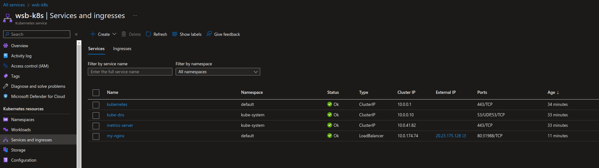

#### Task 1. Creating a deployment

```
> kubectl apply -f depl.yaml 
deployment.apps/my-nginx created

> kubectl get pods -o wide
NAME                       READY   STATUS    RESTARTS   AGE   IP            NODE                                NOMINATED NODE   READINESS GATES
my-nginx-cf54cdbf7-bzjsl   1/1     Running   0          13s   10.244.0.12   aks-agentpool-78291940-vmss000000   <none>           <none>
my-nginx-cf54cdbf7-gzdk8   1/1     Running   0          13s   10.244.0.11   aks-agentpool-78291940-vmss000000   <none>           <none>
```

#### Task 2. Creating service

```
> kubectl get deployments
NAME       READY   UP-TO-DATE   AVAILABLE   AGE
my-nginx   2/2     2            2           2m6s

> kubectl expose deployment my-nginx
service/my-nginx exposed

> kubectl describe service my-nginx
Name:              my-nginx
Namespace:         default
Labels:            <none>
Annotations:       <none>
Selector:          run=my-nginx
Type:              ClusterIP
IP Family Policy:  SingleStack
IP Families:       IPv4
IP:                10.0.174.74
IPs:               10.0.174.74
Port:              <unset>  80/TCP
TargetPort:        80/TCP
Endpoints:         10.244.0.11:80,10.244.0.12:80
Session Affinity:  None
Events:            <none>
```

#### Task 3. Accessing the service from within the cluster using dns

```
> kubectl get svc --namespace=kube-system
NAME             TYPE        CLUSTER-IP   EXTERNAL-IP   PORT(S)         AGE
kube-dns         ClusterIP   10.0.0.10    <none>        53/UDP,53/TCP   24m
metrics-server   ClusterIP   10.0.41.82   <none>        443/TCP         24m
```

```
> kubectl run curl --image=radial/busyboxplus:curl -i --tty --rm
[ root@curl:/ ]$ nslookup my-nginx
Server:    10.0.0.10
Address 1: 10.0.0.10 kube-dns.kube-system.svc.cluster.local

Name:      my-nginx
Address 1: 10.0.174.74 my-nginx.default.svc.cluster.local

[ root@curl:/ ]$ curl my-nginx.default.svc.cluster.local
<!DOCTYPE html>
<html>
<head>
<title>Welcome to nginx!</title>
...
<p><em>Thank you for using nginx.</em></p>
</body>
</html>
```

#### Task 4. Exposing the service

```
> kubectl get svc
NAME         TYPE        CLUSTER-IP    EXTERNAL-IP   PORT(S)   AGE
kubernetes   ClusterIP   10.0.0.1      <none>        443/TCP   29m
my-nginx     ClusterIP   10.0.174.74   <none>        80/TCP    7m1s

> kubectl edit svc my-nginx
# spec.type: LoadBalancer
service/my-nginx edited

> kubectl get svc my-nginx
NAME       TYPE           CLUSTER-IP    EXTERNAL-IP     PORT(S)        AGE
my-nginx   LoadBalancer   10.0.174.74   20.23.175.128   80:31988/TCP   7m39s
```

```
> curl 20.23.175.128
<!DOCTYPE html>
<html>
<head>
<title>Welcome to nginx!</title>
...
<p><em>Thank you for using nginx.</em></p>
</body>
</html>
```



```
> kubectl describe svc my-nginx
Name:                     my-nginx
Namespace:                default
Labels:                   <none>
Annotations:              <none>
Selector:                 run=my-nginx
Type:                     LoadBalancer
IP Family Policy:         SingleStack
IP Families:              IPv4
IP:                       10.0.174.74
IPs:                      10.0.174.74
LoadBalancer Ingress:     20.23.175.128
Port:                     <unset>  80/TCP
TargetPort:               80/TCP
NodePort:                 <unset>  31988/TCP
Endpoints:                10.244.0.11:80,10.244.0.12:80
Session Affinity:         None
External Traffic Policy:  Cluster
Events:
  Type    Reason                Age    From                Message
  ----    ------                ----   ----                -------
  Normal  Type                  5m24s  service-controller  ClusterIP -> LoadBalancer
  Normal  EnsuringLoadBalancer  5m24s  service-controller  Ensuring load balancer
  Normal  EnsuredLoadBalancer   5m14s  service-controller  Ensured load balancer
```

```
> kubectl delete svc my-nginx
service "my-nginx" deleted

> kubectl delete deployment my-nginx
deployment.apps "my-nginx" deleted
```