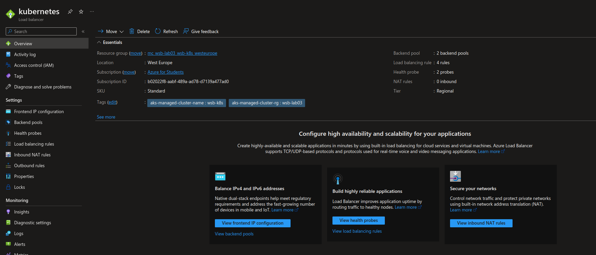

#### Task 1. Creating Ingress Controller and LoadBalancer

```
> kubectl apply -f https://raw.githubusercontent.com/kubernetes/ingress-nginx/controller-v1.5.1/deploy/static/provider/cloud/deploy.yaml
namespace/ingress-nginx created
serviceaccount/ingress-nginx created
serviceaccount/ingress-nginx-admission created
role.rbac.authorization.k8s.io/ingress-nginx created
role.rbac.authorization.k8s.io/ingress-nginx-admission created
clusterrole.rbac.authorization.k8s.io/ingress-nginx created
clusterrole.rbac.authorization.k8s.io/ingress-nginx-admission created
rolebinding.rbac.authorization.k8s.io/ingress-nginx created
rolebinding.rbac.authorization.k8s.io/ingress-nginx-admission created
clusterrolebinding.rbac.authorization.k8s.io/ingress-nginx created
clusterrolebinding.rbac.authorization.k8s.io/ingress-nginx-admission created
configmap/ingress-nginx-controller created
service/ingress-nginx-controller created
service/ingress-nginx-controller-admission created
deployment.apps/ingress-nginx-controller created
job.batch/ingress-nginx-admission-create created
job.batch/ingress-nginx-admission-patch created
ingressclass.networking.k8s.io/nginx created
validatingwebhookconfiguration.admissionregistration.k8s.io/ingress-nginx-admission created

> kubectl apply -f cloud-generic.yaml 
service/ingress-nginx created

> kubectl get svc --namespace=ingress-nginx
NAME                                 TYPE           CLUSTER-IP     EXTERNAL-IP     PORT(S)                      AGE
ingress-nginx                        LoadBalancer   10.0.121.142   20.23.212.142   80:32583/TCP,443:32070/TCP   3m11s
ingress-nginx-controller             LoadBalancer   10.0.189.121   20.23.212.40    80:32702/TCP,443:30544/TCP   3m47s
ingress-nginx-controller-admission   ClusterIP      10.0.23.122    <none>          443/TCP                      3m47s
```

```
> az network lb list -o table
Location    Name        ProvisioningState    ResourceGroup                    ResourceGuid
----------  ----------  -------------------  -------------------------------  ------------------------------------
westeurope  kubernetes  Succeeded            mc_wsb-lab03_wsb-k8s_westeurope  04694885-07ea-4508-bc81-64b4fd3bb17d

```



#### Task 2. Creating services

```
> kubectl get svc
NAME         TYPE        CLUSTER-IP   EXTERNAL-IP   PORT(S)   AGE
kubernetes   ClusterIP   10.0.0.1     <none>        443/TCP   164m

> kubectl apply -f servicea.yaml 
pod/myservicea created
service/myservicea created

> kubectl apply -f serviceb.yaml 
pod/myserviceb created
service/myserviceb created

> kubectl get svc
NAME         TYPE        CLUSTER-IP     EXTERNAL-IP   PORT(S)    AGE
kubernetes   ClusterIP   10.0.0.1       <none>        443/TCP    164m
myservicea   ClusterIP   10.0.165.229   <none>        5678/TCP   9s
myserviceb   ClusterIP   10.0.18.18     <none>        5678/TCP   3s

> kubectl get pods
NAME         READY   STATUS    RESTARTS   AGE
myservicea   1/1     Running   0          12s
myserviceb   1/1     Running   0          6s
```

#### Task 3. Creating Ingress object

```
> kubectl apply -f ingress.yaml 
ingress.networking.k8s.io/myservicea created
ingress.networking.k8s.io/myserviceb created

> kubectl get ingress
NAME         CLASS   HOSTS   ADDRESS   PORTS   AGE
myservicea   nginx   *                 80      8s
myserviceb   nginx   *                 80      7s

> kubectl get ingress myservicea -o yaml
apiVersion: networking.k8s.io/v1
kind: Ingress
metadata:
  annotations:
    kubectl.kubernetes.io/last-applied-configuration: |
      {"apiVersion":"networking.k8s.io/v1","kind":"Ingress","metadata":{"annotations":{},"name":"myservicea","namespace":"default"},"spec":{"ingressClassName":"nginx","rules":[{"http":{"paths":[{"backend":{"service":{"name":"myservicea","port":{"number":5678}}},"path":"/myservicea","pathType":"Prefix"}]}}]}}
  creationTimestamp: "2022-11-17T18:17:50Z"
  generation: 1
  name: myservicea
  namespace: default
  resourceVersion: "37777"
  uid: 34f1ac65-bace-4c3c-8e3e-1abb24bf322f
spec:
  ingressClassName: nginx
  rules:
  - http:
      paths:
      - backend:
          service:
            name: myservicea
            port:
              number: 5678
        path: /myservicea
        pathType: Prefix
status:
  loadBalancer:
    ingress:
    - ip: 20.23.212.40
```

#### Task 4. Examining the solution

```
> kubectl get svc --namespace=ingress-nginx
NAME                                 TYPE           CLUSTER-IP     EXTERNAL-IP     PORT(S)                      AGE
ingress-nginx                        LoadBalancer   10.0.121.142   20.23.212.142   80:32583/TCP,443:32070/TCP   16m
ingress-nginx-controller             LoadBalancer   10.0.189.121   20.23.212.40    80:32702/TCP,443:30544/TCP   16m
ingress-nginx-controller-admission   ClusterIP      10.0.23.122    <none>          443/TCP                      16m
```

```
> curl 20.23.212.40
<html>
<head><title>404 Not Found</title></head>
<body>
<center><h1>404 Not Found</h1></center>
<hr><center>nginx</center>
</body>
</html>

> curl 20.23.212.40/myservicea
myservicea

> curl 20.23.212.40/myserviceb
myserviceb
```