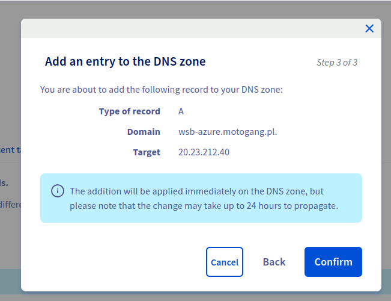
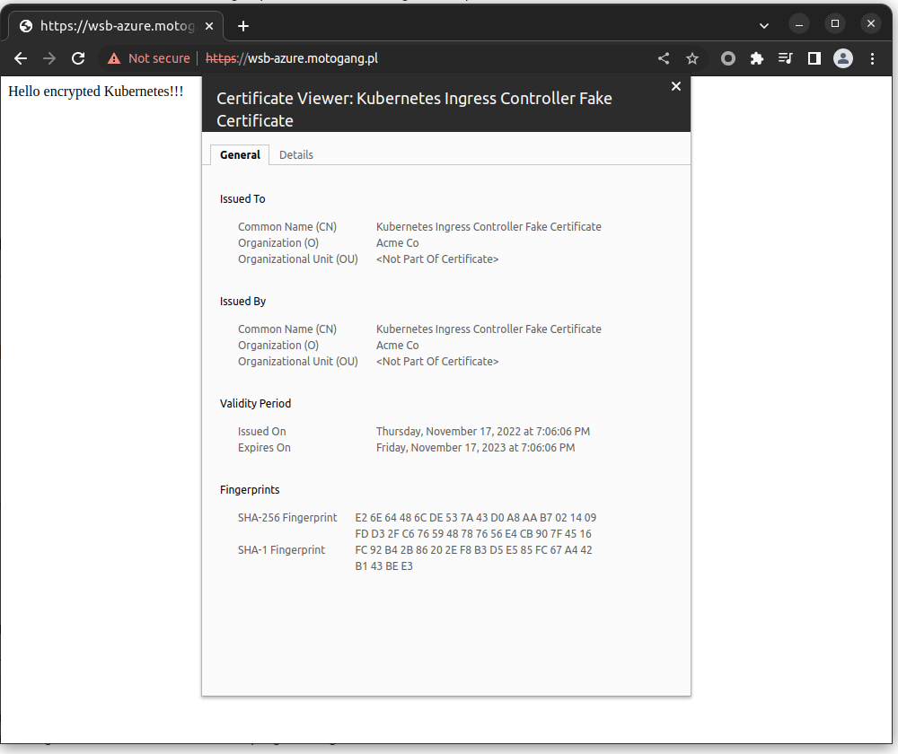
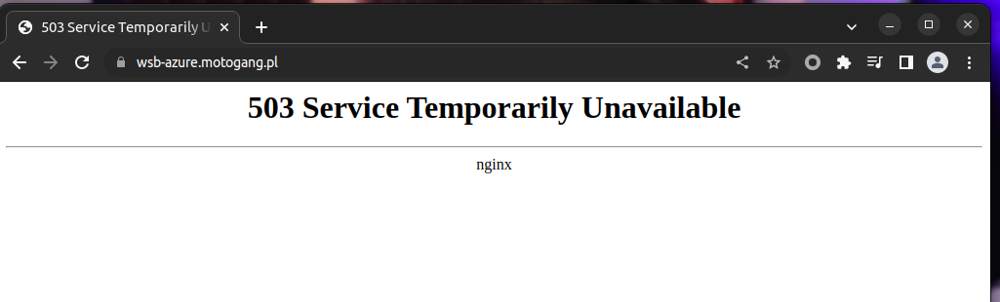
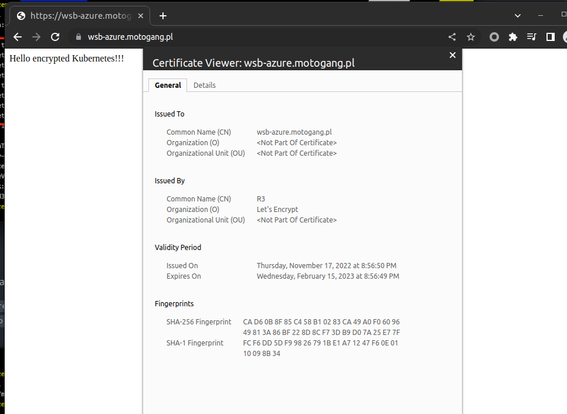

#### Task 1. Creating an nginx controller

```
> kubectl get svc -n ingress-nginx
NAME                                 TYPE           CLUSTER-IP     EXTERNAL-IP    PORT(S)                      AGE
ingress-nginx-controller             LoadBalancer   10.0.189.121   20.23.212.40   80:32702/TCP,443:30544/TCP   28m
ingress-nginx-controller-admission   ClusterIP      10.0.23.122    <none>         443/TCP                      28m
```

#### Task 2. Creating nginx deployment

```
> kubectl apply -f 2_deployment.yaml 
deployment.apps/tls-nginx created
service/tls-nginx created

> kubectl get svc
NAME         TYPE        CLUSTER-IP     EXTERNAL-IP   PORT(S)   AGE
kubernetes   ClusterIP   10.0.0.1       <none>        443/TCP   3h5m
tls-nginx    ClusterIP   10.0.143.129   <none>        80/TCP    64s
```

#### Task 3. Creating ingress for nginx deployment

```
> kubectl apply -f 3_simple_ingress.yaml 
error: resource mapping not found for name: "ingress" namespace: "" from "3_simple_ingress.yaml": no matches for kind "Ingress" in version "extensions/v1beta1"
ensure CRDs are installed first
```

[https://kubernetes.io/docs/reference/using-api/deprecation-guide/#ingress-v122](https://kubernetes.io/docs/reference/using-api/deprecation-guide/#ingress-v122)

```
> kubectl apply -f 3_simple_ingress.yaml 
ingress.networking.k8s.io/ingress created

> kubectl get ingress
NAME      CLASS    HOSTS   ADDRESS        PORTS   AGE
ingress   <none>   *       20.23.212.40   80      69s

> kubectl get ingress ingress -o yaml
apiVersion: networking.k8s.io/v1
kind: Ingress
metadata:
  annotations:
    kubectl.kubernetes.io/last-applied-configuration: |
      {"apiVersion":"networking.k8s.io/v1","kind":"Ingress","metadata":{"annotations":{"kubernetes.io/ingress.class":"nginx","nginx.ingress.kubernetes.io/proxy-connect-timeout":"240","nginx.ingress.kubernetes.io/proxy-read-timeout":"240","nginx.ingress.kubernetes.io/proxy-send-timeout":"240","nginx.ingress.kubernetes.io/send_timeout":"60"},"name":"ingress","namespace":"default"},"spec":{"rules":[{"http":{"paths":[{"backend":{"service":{"name":"tls-nginx","port":{"number":80}}},"path":"/","pathType":"ImplementationSpecific"}]}}]}}
    kubernetes.io/ingress.class: nginx
    nginx.ingress.kubernetes.io/proxy-connect-timeout: "240"
    nginx.ingress.kubernetes.io/proxy-read-timeout: "240"
    nginx.ingress.kubernetes.io/proxy-send-timeout: "240"
    nginx.ingress.kubernetes.io/send_timeout: "60"
  creationTimestamp: "2022-11-17T18:50:36Z"
  generation: 1
  name: ingress
  namespace: default
  resourceVersion: "45236"
  uid: 9fe358b7-be07-41e9-8f6d-b5205a9328dd
spec:
  rules:
  - http:
      paths:
      - backend:
          service:
            name: tls-nginx
            port:
              number: 80
        path: /
        pathType: ImplementationSpecific
status:
  loadBalancer:
    ingress:
    - ip: 20.23.212.40
```

```
> curl 20.23.212.40
Hello encrypted Kubernetes!!!
```

#### Task 4. Adding cert manager

```
> kubectl create namespace cert-manager
namespace/cert-manager created

> kubectl get namespaces
NAME              STATUS   AGE
cert-manager      Active   16s
default           Active   3h33m
ingress-nginx     Active   59m
kube-node-lease   Active   3h33m
kube-public       Active   3h33m
kube-system       Active   3h33m
```

```
> kubectl apply -f https://github.com/cert-manager/cert-manager/releases/download/v1.10.0/cert-manager.yaml
namespace/cert-manager created
customresourcedefinition.apiextensions.k8s.io/clusterissuers.cert-manager.io unchanged
customresourcedefinition.apiextensions.k8s.io/challenges.acme.cert-manager.io unchanged
customresourcedefinition.apiextensions.k8s.io/certificaterequests.cert-manager.io unchanged
customresourcedefinition.apiextensions.k8s.io/issuers.cert-manager.io unchanged
customresourcedefinition.apiextensions.k8s.io/certificates.cert-manager.io unchanged
customresourcedefinition.apiextensions.k8s.io/orders.acme.cert-manager.io unchanged
serviceaccount/cert-manager-cainjector created
serviceaccount/cert-manager created
serviceaccount/cert-manager-webhook created
configmap/cert-manager-webhook created
clusterrole.rbac.authorization.k8s.io/cert-manager-cainjector unchanged
clusterrole.rbac.authorization.k8s.io/cert-manager-controller-issuers unchanged
clusterrole.rbac.authorization.k8s.io/cert-manager-controller-clusterissuers unchanged
clusterrole.rbac.authorization.k8s.io/cert-manager-controller-certificates unchanged
clusterrole.rbac.authorization.k8s.io/cert-manager-controller-orders unchanged
clusterrole.rbac.authorization.k8s.io/cert-manager-controller-challenges unchanged
clusterrole.rbac.authorization.k8s.io/cert-manager-controller-ingress-shim unchanged
clusterrole.rbac.authorization.k8s.io/cert-manager-view unchanged
clusterrole.rbac.authorization.k8s.io/cert-manager-edit unchanged
clusterrole.rbac.authorization.k8s.io/cert-manager-controller-approve:cert-manager-io unchanged
clusterrole.rbac.authorization.k8s.io/cert-manager-controller-certificatesigningrequests unchanged
clusterrole.rbac.authorization.k8s.io/cert-manager-webhook:subjectaccessreviews unchanged
clusterrolebinding.rbac.authorization.k8s.io/cert-manager-cainjector unchanged
clusterrolebinding.rbac.authorization.k8s.io/cert-manager-controller-issuers unchanged
clusterrolebinding.rbac.authorization.k8s.io/cert-manager-controller-clusterissuers unchanged
clusterrolebinding.rbac.authorization.k8s.io/cert-manager-controller-certificates unchanged
clusterrolebinding.rbac.authorization.k8s.io/cert-manager-controller-orders unchanged
clusterrolebinding.rbac.authorization.k8s.io/cert-manager-controller-challenges unchanged
clusterrolebinding.rbac.authorization.k8s.io/cert-manager-controller-ingress-shim unchanged
clusterrolebinding.rbac.authorization.k8s.io/cert-manager-controller-approve:cert-manager-io unchanged
clusterrolebinding.rbac.authorization.k8s.io/cert-manager-controller-certificatesigningrequests unchanged
clusterrolebinding.rbac.authorization.k8s.io/cert-manager-webhook:subjectaccessreviews configured
role.rbac.authorization.k8s.io/cert-manager-cainjector:leaderelection unchanged
role.rbac.authorization.k8s.io/cert-manager:leaderelection unchanged
role.rbac.authorization.k8s.io/cert-manager-webhook:dynamic-serving created
rolebinding.rbac.authorization.k8s.io/cert-manager-cainjector:leaderelection unchanged
rolebinding.rbac.authorization.k8s.io/cert-manager:leaderelection configured
rolebinding.rbac.authorization.k8s.io/cert-manager-webhook:dynamic-serving created
service/cert-manager created
service/cert-manager-webhook created
deployment.apps/cert-manager-cainjector created
deployment.apps/cert-manager created
deployment.apps/cert-manager-webhook created
mutatingwebhookconfiguration.admissionregistration.k8s.io/cert-manager-webhook configured
validatingwebhookconfiguration.admissionregistration.k8s.io/cert-manager-webhook configured
```

```
> kubectl get pods -n cert-manager
NAME                                      READY   STATUS    RESTARTS   AGE
cert-manager-64456d445d-d6v9z             1/1     Running   0          98s
cert-manager-cainjector-b4d945685-xvhfm   1/1     Running   0          98s
cert-manager-webhook-b474995bf-wwph7      1/1     Running   0          98s
```

#### Task 5. Configure the cert-manager for using Let's Encrypt issuer.

```
> kubectl apply -f 4_issuer.yaml -n cert-manager
error: resource mapping not found for name: "letsencrypt-prod" namespace: "" from "4_issuer.yaml": no matches for kind "Issuer" in version "cert-manager.io/v1alpha2"
ensure CRDs are installed first
```

apiVersion: cert-manager.io/v1

```
> kubectl apply -f 4_issuer.yaml -n cert-manager
issuer.cert-manager.io/letsencrypt-prod created
```

#### Task 6. Creating DNS record



```
> nslookup wsb-azure.motogang.pl
Server:		127.0.0.53
Address:	127.0.0.53#53

Non-authoritative answer:
Name:	wsb-azure.motogang.pl
Address: 20.23.212.40

> curl wsb-azure.motogang.pl
Hello encrypted Kubernetes!!!
```

#### Task 7. Creating certificate and changing ingress

[https://cert-manager.io/docs/installation/upgrading/upgrading-0.7-0.8/#performing-an-incremental-switch-to-the-new-format](https://cert-manager.io/docs/installation/upgrading/upgrading-0.7-0.8/#performing-an-incremental-switch-to-the-new-format)

[https://cert-manager.io/docs/tutorials/acme/dns-validation/](https://cert-manager.io/docs/tutorials/acme/dns-validation/)

```
> kubectl apply -f 5_certificate.yaml 
error: error validating "5_certificate.yaml": error validating data: ValidationError(Certificate.spec): unknown field "acme" in io.cert-manager.v1.Certificate.spec; if you choose to ignore these errors, turn validation off with --validate=false
```

```
> kubectl apply -f 5_certificate.yaml 
certificate.cert-manager.io/secret1 created

> kubectl apply -f 6_ingress.yaml 
ingress.networking.k8s.io/ingress configured

> kubectl get certs
NAME      READY   SECRET    AGE
secret1   False   secret1   103s

> kubectl get certs secret1 -o yaml
...
status:
  conditions:
  - lastTransitionTime: "2022-11-17T19:37:00Z"
    message: Issuing certificate as Secret does not exist
    observedGeneration: 1
    reason: DoesNotExist
    status: "False"
    type: Ready
  - lastTransitionTime: "2022-11-17T19:37:00Z"
    message: Issuing certificate as Secret does not exist
    observedGeneration: 1
    reason: DoesNotExist
    status: "True"
    type: Issuing
  nextPrivateKeySecretName: secret1-2kvsw
```

hm. :)  
[https://cert-manager.io/docs/troubleshooting/](https://cert-manager.io/docs/troubleshooting/)

```
> kubectl get event
LAST SEEN   TYPE     REASON            OBJECT                                   MESSAGE
37m         Normal   RegisteredNode    node/aks-agentpool-78291940-vmss000000   Node aks-agentpool-78291940-vmss000000 event: Registered Node aks-agentpool-78291940-vmss000000 in Controller
6m45s       Normal   Sync              ingress/ingress                          Scheduled for sync
8m22s       Normal   cert-manager.io   certificaterequest/secret1-x2dx9         Certificate request has been approved by cert-manager.io
8m22s       Normal   IssuerNotFound    certificaterequest/secret1-x2dx9         Referenced "Issuer" not found: issuer.cert-manager.io "letsencrypt-prod" not found
8m22s       Normal   IssuerNotFound    certificaterequest/secret1-x2dx9         Referenced "Issuer" not found: issuer.cert-manager.io "letsencrypt-prod" not found
8m22s       Normal   IssuerNotFound    certificaterequest/secret1-x2dx9         Referenced "Issuer" not found: issuer.cert-manager.io "letsencrypt-prod" not found
8m22s       Normal   IssuerNotFound    certificaterequest/secret1-x2dx9         Referenced "Issuer" not found: issuer.cert-manager.io "letsencrypt-prod" not found
8m22s       Normal   IssuerNotFound    certificaterequest/secret1-x2dx9         Referenced "Issuer" not found: issuer.cert-manager.io "letsencrypt-prod" not found
8m23s       Normal   Issuing           certificate/secret1                      Issuing certificate as Secret does not exist
8m22s       Normal   Generated         certificate/secret1                      Stored new private key in temporary Secret resource "secret1-2kvsw"
8m22s       Normal   Requested         certificate/secret1                      Created new CertificateRequest resource "secret1-x2dx9"
```

```
> kubectl describe certificaterequest secret1
Status:
  Conditions:
    Last Transition Time:  2022-11-17T19:37:01Z
    Message:               Certificate request has been approved by cert-manager.io
    Reason:                cert-manager.io
    Status:                True
    Type:                  Approved
    Last Transition Time:  2022-11-17T19:37:01Z
    Message:               Referenced "Issuer" not found: issuer.cert-manager.io "letsencrypt-prod" not found
    Reason:                Pending
    Status:                False
    Type:                  Ready
Events:
  Type    Reason           Age   From                                                Message
  ----    ------           ----  ----                                                -------
  Normal  cert-manager.io  12m   cert-manager-certificaterequests-approver           Certificate request has been approved by cert-manager.io
  Normal  IssuerNotFound   12m   cert-manager-certificaterequests-issuer-selfsigned  Referenced "Issuer" not found: issuer.cert-manager.io "letsencrypt-prod" not found
  Normal  IssuerNotFound   12m   cert-manager-certificaterequests-issuer-vault       Referenced "Issuer" not found: issuer.cert-manager.io "letsencrypt-prod" not found
  Normal  IssuerNotFound   12m   cert-manager-certificaterequests-issuer-ca          Referenced "Issuer" not found: issuer.cert-manager.io "letsencrypt-prod" not found
  Normal  IssuerNotFound   12m   cert-manager-certificaterequests-issuer-acme        Referenced "Issuer" not found: issuer.cert-manager.io "letsencrypt-prod" not found
  Normal  IssuerNotFound   12m   cert-manager-certificaterequests-issuer-venafi      Referenced "Issuer" not found: issuer.cert-manager.io "letsencrypt-prod" not found
```

```
> kubectl get issuer -n cert-manager
NAME               READY   AGE
letsencrypt-prod   True    53m

> kubectl describe issuer letsencrypt-prod -n cert-manager
...
Status:
  Acme:
    Last Registered Email:  fohec97543@lidely.com
    Uri:                    https://acme-v02.api.letsencrypt.org/acme/acct/828968837
  Conditions:
    Last Transition Time:  2022-11-17T19:09:11Z
    Message:               The ACME account was registered with the ACME server
    Observed Generation:   1
    Reason:                ACMEAccountRegistered
    Status:                True
    Type:                  Ready
Events:                    <none>
```

Trochę czasu później...  
Skoro mamy Issuera, a nie ClusterIssuera, a ten ma prawo bytu tylko w obrębie danego NSa... ;)

```
> kubectl apply -f 5_certificate.yaml -n cert-manager
certificate.cert-manager.io/secret1 created

> kubectl get certs -n cert-manager
NAME      READY   SECRET    AGE
secret1   True    secret1   34s

> kubectl describe certs secret1 -n cert-manager
...
Events:
  Type    Reason     Age   From                                       Message
  ----    ------     ----  ----                                       -------
  Normal  Issuing    27s   cert-manager-certificates-trigger          Issuing certificate as Secret does not exist
  Normal  Generated  27s   cert-manager-certificates-key-manager      Stored new private key in temporary Secret resource "secret1-qhnc9"
  Normal  Requested  26s   cert-manager-certificates-request-manager  Created new CertificateRequest resource "secret1-2knbr"
  Normal  Issuing    0s    cert-manager-certificates-issuing          The certificate has been successfully issued
```

```
> kubectl apply -f 6_ingress.yaml 
ingress.networking.k8s.io/ingress configured
```



Po wrzuceniu w NS.



No to może jednak ClusterIssuer?  
Albo w drugą stronę, zarówno Issuer jak i Cert powinny być w NS default, ze względu na Ingressa.  
Jak powiedział tak zrobił i...



Yay. :)