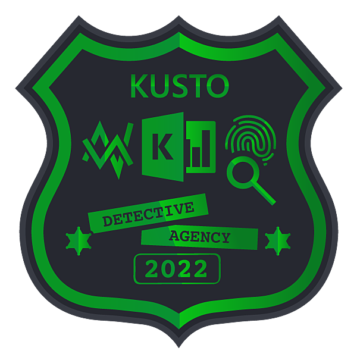

#### Badges



#### Welcome to Kusto Detective Agency

* Dodajemy wszystkie wartości do siebie.

```
Onboarding
| summarize sum(Score)
```

#### The rarest book is missing
* Sprawdzamy wagę poszukiwanej książki,
* Przeliczamy wagi książek na konkretnych półkach (łączac rfid z konkretnymi książkami),
* Szukamy takiej półki gdzie różnica w wagach jest wystarczająca dla brakującej pozycji

```
let bookWeight = search in (Books) "De Revolutionibus Magnis Data" | project weight_gram;
let bookWeight2 = 1764;

Shelves
| mv-expand rf_ids
| extend rfid = tostring(rf_ids)
| join kind=inner Books on $left.rfid == $right.rf_id
| summarize sum(weight_gram) by shelf, total_weight
| extend diff_weight = total_weight - sum_weight_gram
| where diff_weight > bookWeight2