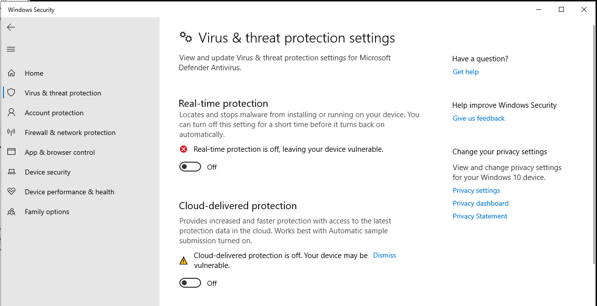
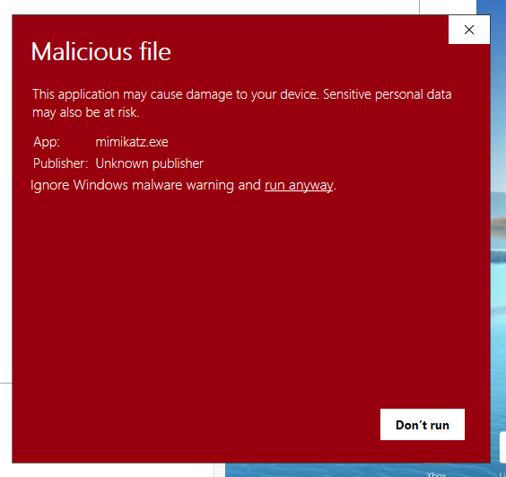
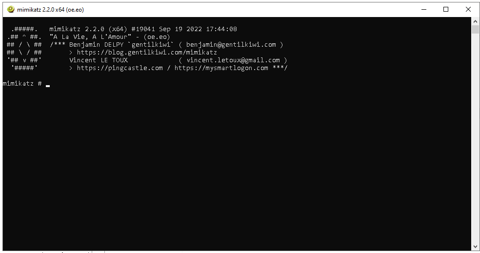
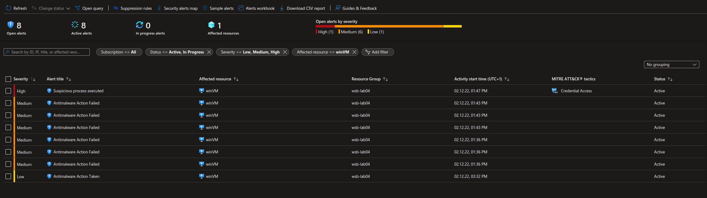
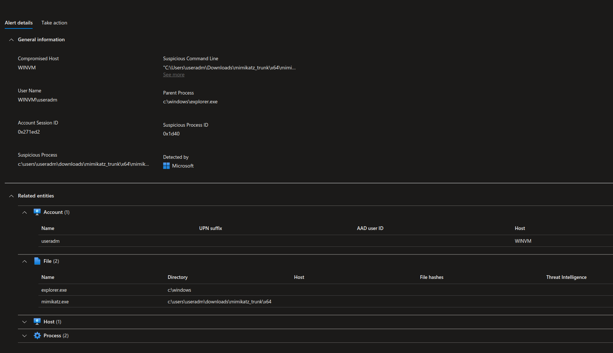
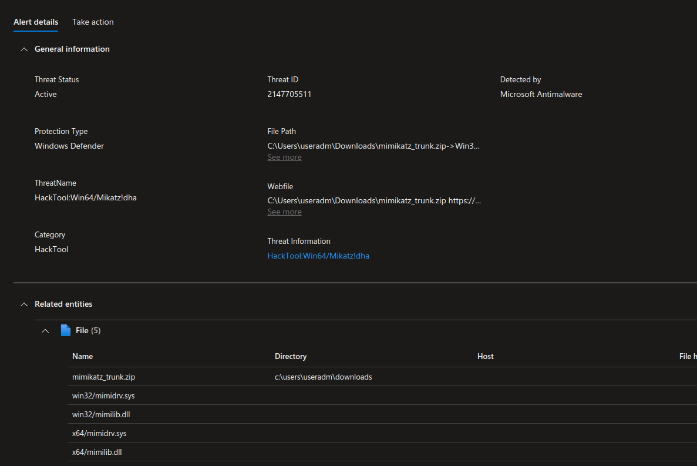

#### Tworzenie maszyny opartej na windowsie

Analogicznie do poprzedniego ćwiczenia dodajemy vmkę, tym razem opartą o windows10,  
następnie przy protokołu RDP łączymy się z maszyną.  
  
Wyłączamy `Real-time protection`

Ściągamy paczkę releasową mimikatza, rozpakowywujemy i uruchamiamy.

Podziwiamy co tam ciekawego Defender wykrył. ;)

