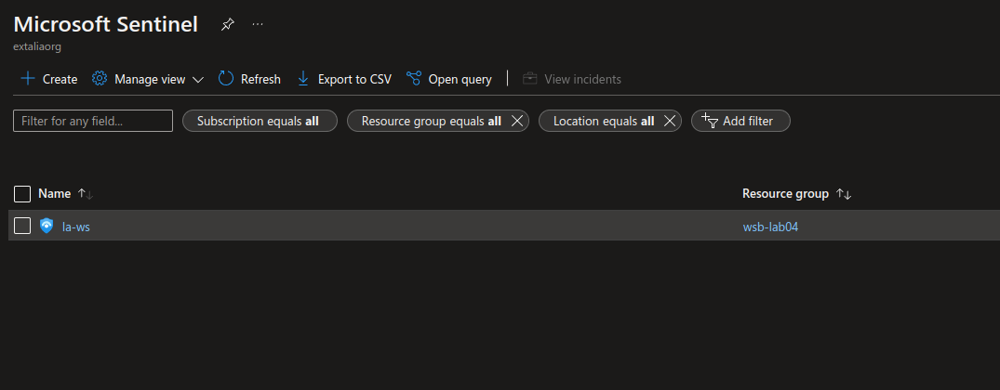
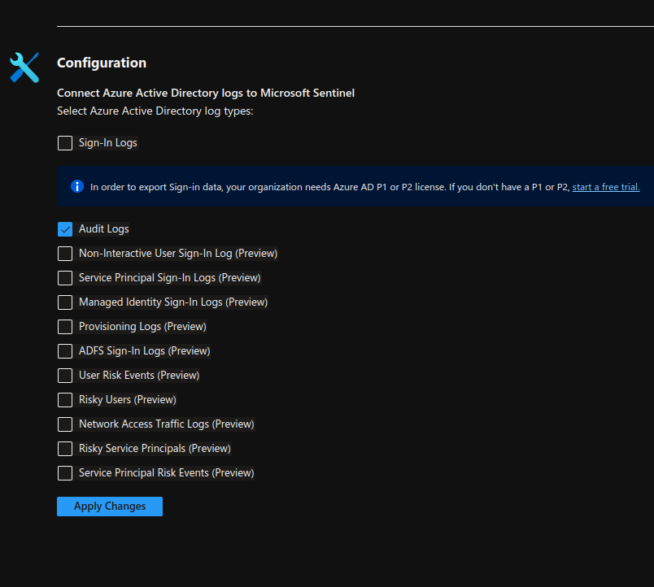
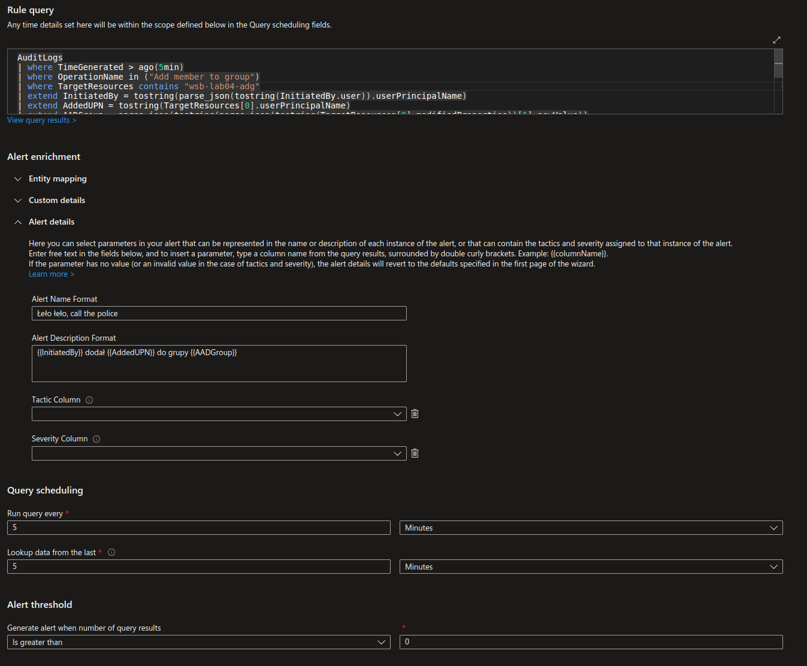
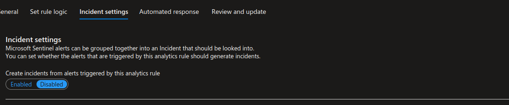
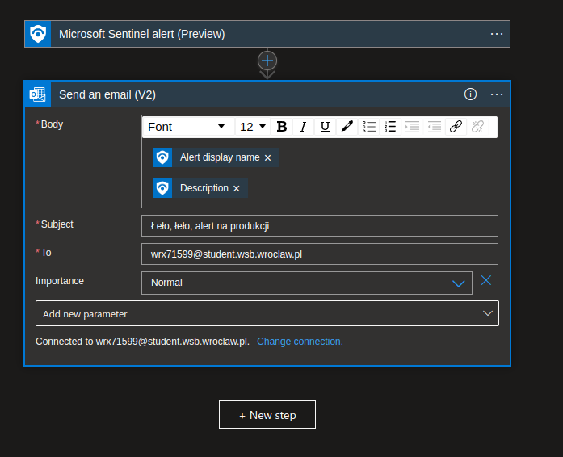
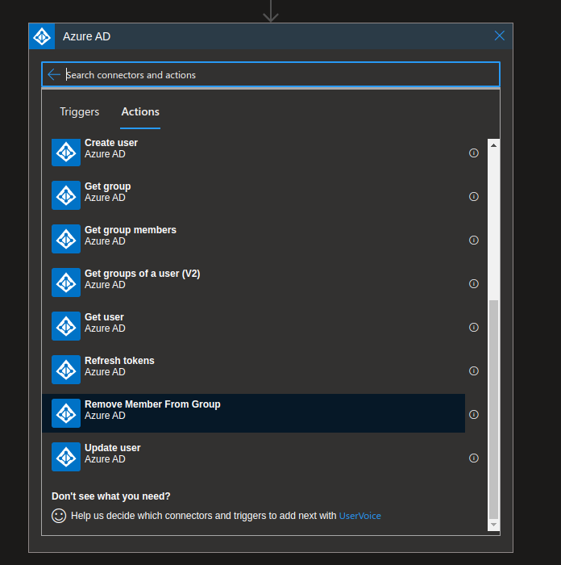
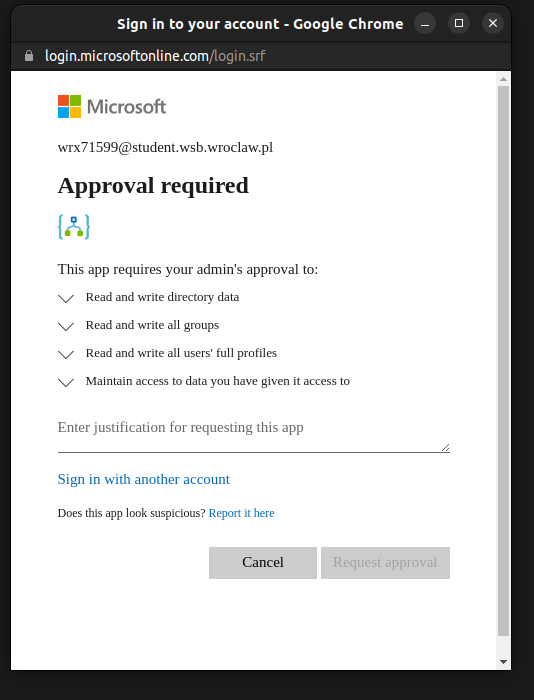
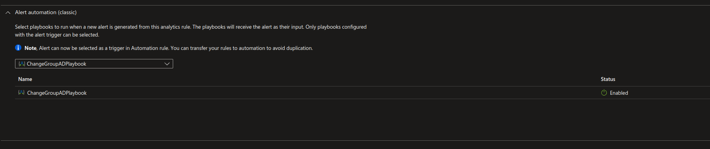
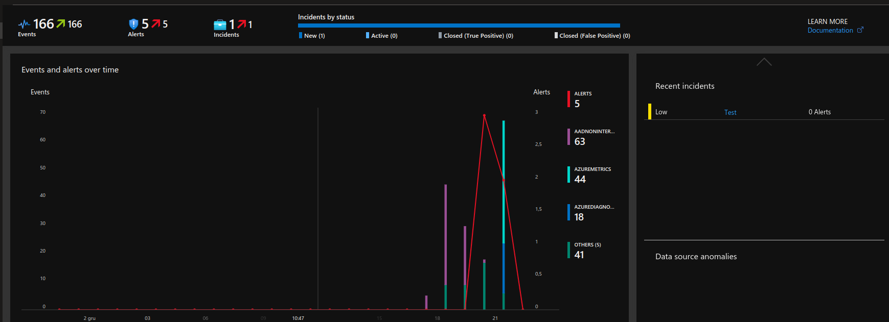
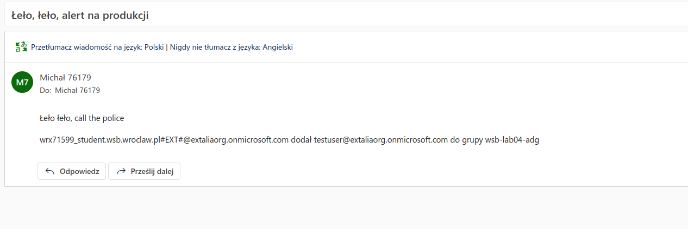

#### Stwórz usługę Azure Sentinel.

Przechodzimy do `All resources -> Microsoft Sentinel`, tworzymy nowy WS dla Sentinela.

#### Dodanie danych z Azure Active Directory

Configuration -> Data connectors -> Azure Active Directory -> Audit Logs -> Apply changes

#### Dodanie procesu wykrywania nowych członków grupy

Configuration -> Analytics -> Create -> Scheduled query rule

#### Playbook

Configuration -> Automation -> Create -> Playbook with alert trigger

-> Logic app designer

Niestety przy próbie integracji z AD w celu usunięcia użytkownika z grupy

Dodajemy playbook do rulki.

#### Atomowe testy

Dodajemy użytkownika do grupy `wsb-lab04-adg`.

